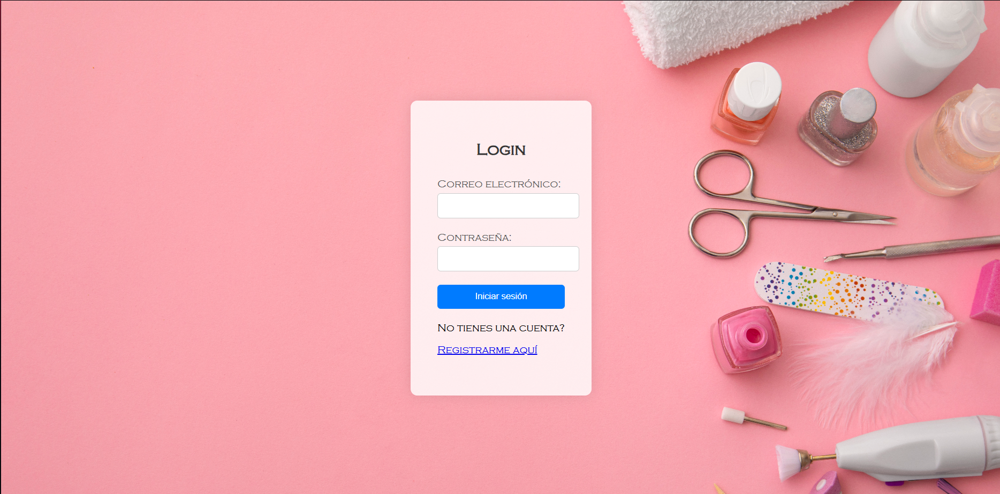
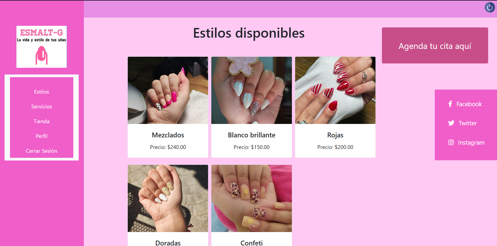
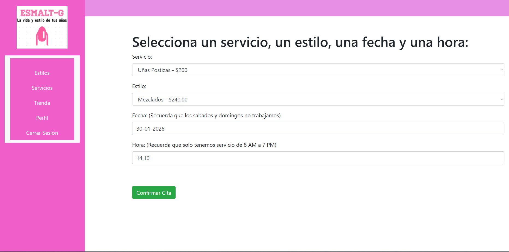
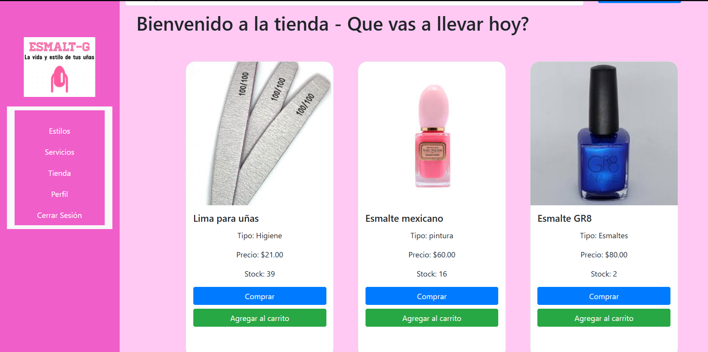

# Nail Appointment and Product Store Platform

University / Academic Project

This project was developed as part of my university studies.  
It is a web-based system intended for learning purposes and runs only in a local environment.

---

## Objectives

The objective of this project is to develop a web platform where users can:

- Purchase nail-related products
- Schedule appointments for nail services at a physical location
- Browse a catalog of nail designs
- Apply web development concepts using both frontend and backend technologies

The project focuses on implementing CRUD operations, database management, and full-stack web development.

---

## Project Description

This system consists of a web platform that allows users to:

- Schedule appointments for nail services
- Browse and purchase nail products
- View a catalog of nail designs
- Interact with different sections of the platform through a user-friendly interface

The platform also includes an administrative section with CRUD functionality, allowing basic management of products, appointments, and related data.

---

## Technologies Used

- HTML
- CSS
- JavaScript
- PHP
- Node.js
- MySQL
- Local server environment (XAMPP)

---

## Environment and Execution

This project runs only in a local environment.  
It does not include an online deployment or live demo.

---

## Screenshots

---

## Notes

This project reflects my knowledge and skills at the time of development.  
It was created as an academic project and is not intended for production use.

This project reflects my knowledge and skills at the time of development.  
It was created as an academic project and is not intended for production use.
